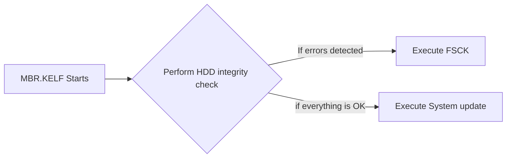

## Memory card updates
the PlayStation2 was capable of loading encrypted executables from both memory card slots to be used as system and DVDPLayer software updates, from paths that vary depending on console model and region (as described on the tables below)

Those updates are encrypted based on a set of keys provided by the console itself.

those keys are system specific (eg: retail, TEST, and namco arcade systems all have their unique set of keys).

this means that an update encrypted on one type of machine won't run on the others.

(eg: install on a retail machine and plug the card into a TEST one and the update will not be accepted).

In adition.
On the memory card update encryption process, the memory card ID code is also used. wich means that the card is not only tied to the machine type that was used on install, it will only decrypt on the memory card used for the installation. hence why system/DVDPlayer update folders have the copy protection property applied most of the time

### Memory card System folders

The directories where PS2 looks for updates and local settings.

__Region__                     |__Boot ROM Region__|__System update__| __Data folder__ [^2] | __DVD Player Update__ [^1]|
------------------------------ | ----------------- | --------------- | -------------------- | ------------------------- |
__Japanese__                   |         `I`       | `BIEXEC-SYSTEM` |    `BIDATA-SYSTEM`   |    `BIEXEC-DVDPLAYER`     |
__American__                   |         `A`       | `BAEXEC-SYSTEM` |    `BADATA-SYSTEM`   |    `BAEXEC-DVDPLAYER`     |
__Asian__                      |         `H`       | `BAEXEC-SYSTEM` |    `BADATA-SYSTEM`   |    `BAEXEC-DVDPLAYER`     |
__Europe / oceania / Russia__  |         `E`       | `BEEXEC-SYSTEM` |    `BEDATA-SYSTEM`   |    `BEEXEC-DVDPLAYER`     |
__Chinese__                    |         `C`       | `BCEXEC-SYSTEM` |    `BCDATA-SYSTEM`   |    `BCEXEC-DVDPLAYER`     |

[^1]: __DVD-player__ update executable name is: `dvdplayer.elf`
[^2]: __Data Folder:__ seen on the console browser as "Your System Configuration" this folder hold the play history file (a file that holds a record of played games, used to generate the towers on the console start animation), also, `TITLE.DB` is held on this folder, a file used by the PS1 retrocompatibility systems

### Memory card System executables

The filenames of the system updates depending on the console model

  __Region__                      |       __Model__      |  __Chassis__  |      __ROM__     |  __ELF filename__  |
--------------------------------- | -------------------- | ------------- | ---------------- | ------------------ |
__Japan__                         | `SCPH-10000`         |    `A`        | `1.00 J`         |   `osdsys.elf` [^3]
__Japan__                         | `SCPH-10000`         |    `A`        | `1.01 J`         |	`osd110.elf` [^3]
__Japan__                         | `SCPH-15000`         |    `A`        | `1.01 J`         |   `osd110.elf` [^3]
__Japan__                         | `SCPH-18000`         |  `A+/AB`      | `1.20 J`         |	`osd130.elf` 
__America__                       | `SCPH-30001`         |   `B/B'`      | `1.10 A`         |   `osd120.elf` 
__America__                       | `SCPH-30001`         |   `C/C'`      | `1.20 A`         |	`osd130.elf`
__Europe / oceania / Russia__     | `SCPH-3000[2/3/4/8]` | `C/C'`        | `1.20 E`         | `osd130.elf`
__All__                           | Most models          | `D` and newer | `1.50` and newer | `osdXXX.elf`[^4] or `osdmain.elf` (in that order)
__Japan__                         | PSX (`DESR`)         |       -       | `1.80` or `2.10` | `xosdmain.elf`

[^3]: __Protokernel system update:__ theese files are used only by Protokernel PS2, FreeMcBoot installer pastes kernel patches that also redirect the system update into the executable used by the `SCPH-18000` patching the kernel and loading FreeMcBoot at the same time. However: Only Browser 2.0 is capable of patching properly and fully this early kernel. The source code of those kernel patches can be found [here](https://github.com/ps2homebrew/OSD-Initialization-Libraries/tree/main/kpatch)

[^4]: `osdXXX.elf` is a specific ROM update. The XXX represents a 3 digit number calculated based on the ROM version of your console.
the number is calculated by rounding the ROM version to the nearest ten.  for example: a `SCPH-70xxx` has ROMVER `0200` (`2.00`). so the name of the specific update will be `osd210.elf`

## HDD Updates

Updates from the HardDrive

Updates loaded from the HDD behave in a different way.

the actual update is not loaded by the console itself. instead, a specifically crafted headerless ELF (encrypted as a KELF) is written into the `__mbr` partition. when an expansion bay model detects the HDD is connected and working, it will try to load this KELF file.

the usual behaviour of the Sony HDD-OSD MBR program is something like this:

The mentioned integrity checks are:
- Checking if HDD is deemed as connected, formatted and usable by the system
- Check [`S.M.A.R.T` status](https://es.wikipedia.org/wiki/S.M.A.R.T.)
- Check Sector errors
- Check if any PFS Partition is marked as damaged

The mentioned `FSCK` is a diagnosis tool designed to "repair" any fixable damage to the filesystem. under sony design, this tool is stored on the `__system` partition. along with the update

### Consoles that dont boot HDD updates autonomously

The following PS2 models dont load HDD updates on their own:
- `SCPH-10000`
- `SCPH-15000`
- `SCPH-18000`
- `SCPH-70xxx` (sony didn't want it on this model)

for the PCMCIA models (from 10k to 18k) sony provided a bootloader that was installed to the memory card along with the HDD Software (Either HDD-OSD or PSBBN)

what those updates did was operate the `HDDLOAD` module, responsible of finding the MBR bootstrap. then copying it to RAM at 0x010000 adress for further execution by the update itself.

since SCPH-18000, the `HDDLOAD` module is included amongst the BOOT ROM (""BIOS"") files. but only the expansion bay models (`SCPH-3xxxx` & `SCPH-5xxxx`) have an OSDSYS program that can use this driver autonomously.
also this module was removed on the first slim, along with all the HDD software.

although this update was made for PCMCIA machines. it's design implicitly allowed support for the `SCPH-70xxx` models, wich still have the HDD connection hardware

FreeMcBoot and PS2BBL offer homebrew alternatives for the HDDLOAD system, wich can be used for the mentioned models at the list on beginning of this topic

## PSX DESR

### Memory card update
PSX DESR Systems have a unique filename for their updates, wich was already mentioned on this article. in adition, PSX-DESR KELF Files have a diferent machine type flag. meaning that most of the time a PS2 KELF wont run on a PSX and vice versa.

However, there is a "small" trick to bypass this issue on the PSX. using a KELF with the DNASLoad user header. wich is whitelisted on the PSX Mechacons, allowing it to be accepted even being flagged as PS2 KELF

### XFROM

PSX-DESR has an internal flash memory (same hardware and filesystem than PS2 common memory cards).
This flash memory is part of the DEV9 system. and an update is booted from there before running the HDD MBR Bootstrap.

the path is `xfrom:/BIEXEC-SYSTEM/xosdmain.elf`

DONT TOUCH THE CONTENTS OF xfrom IF YOU DONT KNOW WHAT YOU'RE DOING!
